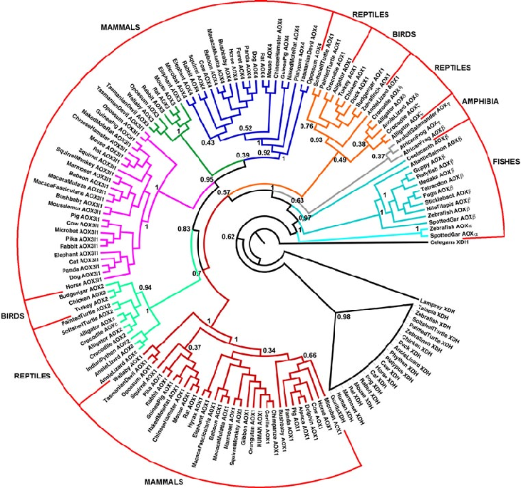

## Pose tracking to genetic trees

While working on [another project](../../../../2019/03/03/dance-montage/) that involved tracking poses of dancers, I was led to another idea.

With data on poses in different dance styles, you could compare pose and movement likeness between different dance styles. This would allow us to look at the relationships between different dance styles and begin to build a network of similarity between them.

Could then do a phylogenetic analysis to see which dances evolved from which other ones.

> Phylogenesis is the evolutionary history of a species or group of related species.
> The study of phylogeny seeks to establish the relationships between groups of species in different taxonomic levels in order to better understand their evolution, and classify species according to their relationship.

*[Source](http://www.futura-sciences.us/dico/d/biology-phylogenesis-50001832/)*.

## Outline of a possible process

### Collect archive of different dance styles.

Could be done in 2d using openpose etc. This would allow one to use all the data on youtube, using tags, as training data.
Alternatively, could use motion tracking. Get full 3d data. More rich, less buggy.

### (If using 2d data) Map data

Use openpose

### Create similarity indexes

Use the well-developed techniques from phylogenesis

## Precedent

There has been some work towards something like this in musical rhythm by Godfried T. Toussaint in [Geometry of Musical Rhythm](https://www.worldcat.org/title/geometry-of-musical-rhythm-what-makes-a-good-rhythm-good-second-edition/).